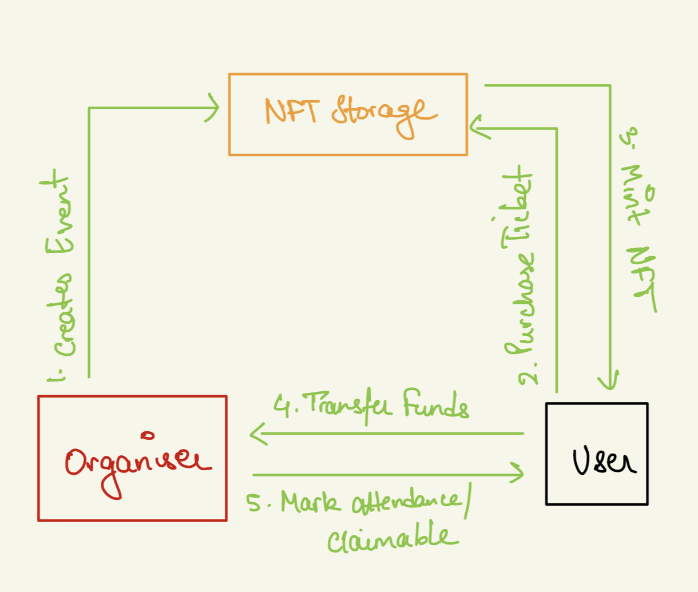

  

# nftix

> NFTIX uses a Cosmos Based Chain, Assetmantle to onboard Web2 users smoothly for buying/selling tickets. The ease of web2 with the decentralised power of web3!

## 🍿 Features

- Easy onboarding of users onto a web3 app using email-based signup
- Fully non-custodial wallets, your keys belong to you because "Not your keys, not your assets" :D
- Easy scan attendance - Organizers just need to scan QR of attendees for marking attendance
- Add Redeemables - Add unlockable content, free phygital items, drinks, snacks etc and verify whether attendees have claimed easily through scanning
- Highly Secure - Each QR scanner comes with a secret which expires every 5 seconds for added security.
- Dashboard for creators as a one access place for their statistics.

  **A lot more to come!**

## ⬇ Installation

- Clone the repo

  `git clone https://github.com/rishabhkeshan/nftix-frontend.git && cd nftix-frontend`

- Run the Project

  Once you are in the project directory nstall the required dependencies using a package manager `yarn` or `npm`.

  `yarn add` or `npm install`

  `yarn start` or `npm start`

- The above commands runs the app in the development mode

  Open [http://localhost:3000](http://localhost:3000) to view it in the browser.

## 📱 Technologies Used

- **[Assetmantle](https://assetmantle.one/):** Cosmos based chain powering the wallets, on-chain minting and buying
- **[NFTStorage](https://nft.storage/):** Storage and Pinning of NFT and event metadata
- **[IPFS](https://ipfs.io/):** NFT.storage using IPFS under the hood for storing and retrieving files
- **[Tailwind](https://tailwind.com):** To build lovely UIs and components
- **[ReactJS](https://reactjs.org/):** The webframework powering our PWA

## 🛠 Flow

## A demostration of App

- Click the Image to be redirected to the Video

## 🤝 Contributions

- Feel Free to Open a PR/Issue for any feature or bug(s).
- Make sure you follow the [community guidelines](https://docs.github.com/en/github/site-policy/github-community-guidelines)!
- Feel free to open an issue to ask a question/discuss anything about nftix.
- Have a feature request? Open an [Issue](https://github.com/rishabhkeshan/nftix-frontend/issues/new)!

## ⚖ License

Copyright 2021 Hemanth Krishna and Rishabh Keshan

Licensed under MIT License : https://opensource.org/licenses/MIT
